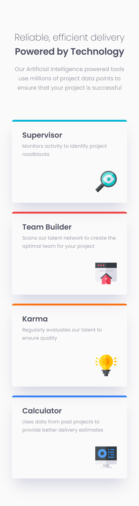

# Frontend Mentor - Four card feature section solution

This is a solution to the [Four card feature section challenge on Frontend Mentor](https://www.frontendmentor.io/challenges/four-card-feature-section-weK1eFYK). Frontend Mentor challenges help you improve your coding skills by building realistic projects. 

## Table of contents

- [Overview](#overview)
  - [The challenge](#the-challenge)
  - [Screenshot](#screenshot)
  - [Links](#links)
- [My process](#my-process)
  - [Built with](#built-with)
  - [What I learned](#what-i-learned)
  - [Continued development](#continued-development)
  - [Useful resources](#useful-resources)
- [Useful commands](#useful-commands)
- [Author](#author)

## Overview

### The challenge
- Responsive layout with four cards
- Users should be able to:
	- View the optimal layout for the site depending on their device's screen size

### Screenshot
<div>
  
  
</div>

### Links

- Solution URL: [My solution URL](https://github.com/MiloosN5/FrontendMentor_FourCardFeatureSectionMaster/blob/main/README.md)
- Live Site URL: [My live site URL](https://miloosn5.github.io/FrontendMentor_FourCardFeatureSectionMaster/)


## My process

### Built with

- Semantic HTML5 markup
- Tailwindcss
- BEM
- Flexbox
- Grid
- Mobile-first workflow
- REM (Root EM) & EM (for Responsive)
- Responsive layout
- [React](https://reactjs.org/) - JS library

### What I learned

* **Grid layout with spans**<br>
    Layout on the smaller devices looks like standard layout with stacking cards one after the another. However, on the desktop, the layout has some shifting. There we have three columns, from which first and third (first and last) are expanded into the two rows. This can be done using grid's property called 'grid-row' ('row-span' - tailwindcss class). Despite this merged two cells into one, we want to keep card's height - not to stretch it. In order to avoid this, our **card** will be wrapped into the container that we will be using for rowspan. Still, our card must have 'margin-block' set to 'auto' in order to be centered vertically. In addition, order of the cards need to be updated when larger screen widths occur. It can be done using 'order' property (but for the wrapper of the card). <br/>
    **Note** Order property requires its parent to has 'flex' or 'grid' display.
    **Note** In the DOM of the code (code below), 'card' refers to 'card-wrapper' and 'card_content' to card itself. It was done that way due to usage of BEM naming convention.

    * Card.jsx
        ```jsx
            const Card = ({ id }) => {

                // different variants (instances) 
                var span = (id==0 || id==3) ? 'd:row-span-2' : '';
                var order = (id==0) ? 'd:order-1' : (id==1) ? 'd:order-2' : (id==2) ? 'd:order-4' : 'd:order-3';

                return (
                    <article className={`card ${span} ${order}`}> 
                        <div className='card__content'> 
                            <div className={`card__indicator ${bgcolor}`}></div>
                            <section className='card__info'>
                                ...
                            </section>
                        </div>
                    </article>
                )
            }
        ```    
        ```css
            /* tailwindcss class */
           .row-span-2 {
	            grid-row: span 2 / span 2;
           }
        ```   

### Continued development

* In-depth explorating of React.
* Aspiration to make better responsive layout.
* Aspiration to make better structure of React components.
* Tending to improve BEM naming convention.
* Better handling of the combo of BEM & Tailwindcss in the same project.

### Useful resources

- [React - Components & Props](https://legacy.reactjs.org/docs/components-and-props.html) - Components are independent and reusable bits of code. They serve the same purpose as JavaScript functions, but work in isolation and return HTML.
- [BEM](https://en.bem.info/) - BEM naming convention is also really important for any projects, expecially the bigger ones.
- [Typographic Hierarchy](https://www.toptal.com/designers/typography/typographic-hierarchy) - Understanding your website structure/hierarchy sometimes can be difficult. Determing accurately typography can be half job done. 
- [An Introduction to Block Element Modifiers (BEM)](https://opensenselabs.com/blog/articles/introduction-block-element-modifiers) - Difference between Block, Modifier and Element.
- [Understanding CSS BEM](https://codeburst.io/understanding-css-bem-naming-convention-a8cca116d252) - Examples of how BEM class namings can be done.
- [BEM Grandchildren](https://scalablecss.com/bem-nesting-grandchild-elements/) - Handling naming of the nesting elements.
- [BEM 101](https://css-tricks.com/bem-101/) - Another source about BEM.
- [Tailwindcss](https://tailwindcss.com/) - Official website of the Tailwindcss. Really useful source, since it's docs is very easy to handle, readable & cover different cases - which predefinex class to use, examples, customizing your theme and so on.
- [@apply](https://tailwindcss.com/docs/reusing-styles) - Handle repetable 'utility combinations'.
- [Tailwindcss - Dynamic Class Name](https://stackoverflow.com/questions/69687530/dynamically-build-classnames-in-tailwindcss) - If you came across an any obstacle, there is a big change that you will find your answer at the 'Stackoverflow'. Also, you can post a question.
- [Ternary operator in React - Conditional Rendering](https://react.dev/learn/conditional-rendering) - There are multiple ways to implement conditional rendering - using ternary operator is one of them.
- [Order](https://css-tricks.com/almanac/properties/o/order/) - Flex items are displayed in the same order as they appear in the source document by default. The order property can be used to change this ordering.
- [rowspan/colspan](https://stackoverflow.com/questions/69317523/how-to-use-row-span-in-a-css-grid) - For merging in either row or column direction.

## Useful commands

**React**
- create new vite application (with React)
    * ```npm create vite@latest```
- install needed packages
    * ```npm install```
- serve app on the localhost (see package.json)
    * ```npm run dev```
- build (predeploy) app for the production - create dist folder (see package.json)
    * ```npm run build```
- deploy app to the GitHub Pages (see package.json)
    * ```gh-pages -d dist```

**Tailwindcss**
- install tailwindcss, postcss & autoprefixer
    * ```npm install -D tailwindcss postcss autoprefixer```
- Generate a Tailwind config file
    * ```npx tailwindcss init -p```

## Author

- GitHub - [MiloosN5](https://github.com/MiloosN5)
- Frontend Mentor - [@MiloosN5](https://www.frontendmentor.io/profile/MiloosN5)


